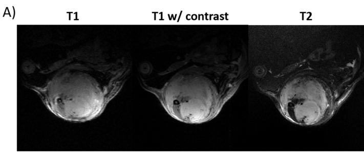
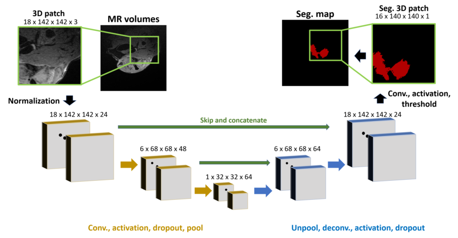
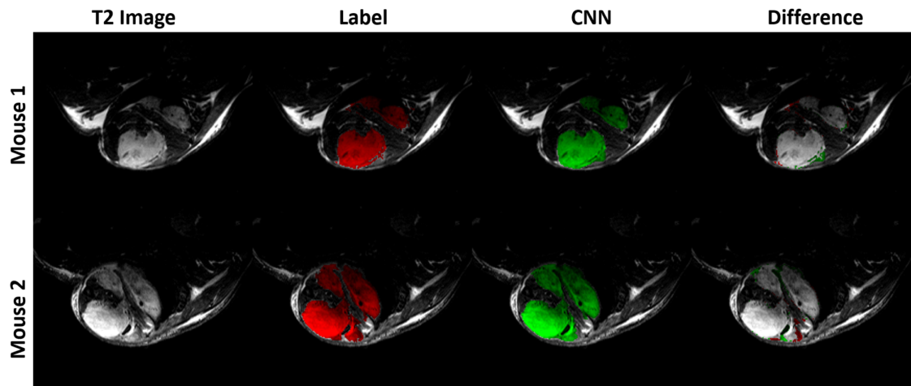
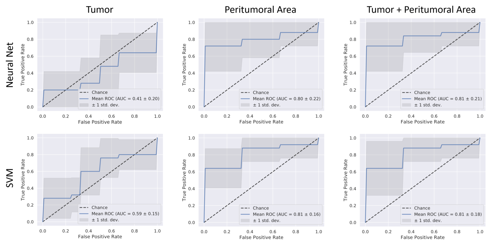

# MRI Segmentation and Radiomics
This repository contains example code from the paper in preparation on preclinical cancer imaging titled "MRI-based 
Deep Learning Segmentation and Radiomics of Sarcoma Tumors in Mice."

This work is part of the [U24 co-clinical trial](https://sites.duke.edu/pcqiba/) of which [CIVM](http://www.civm.duhs.duke.edu/) at Duke University is a participant. This work has been funded by **NIH U24CA220245**.

This goal of this project is to create an pipeline with two facets:
1. Automatic segmentation of soft tissue sarcoma using deep learning.
2. Automate calculation and analysis of radiomic features within the tumor population.

## Data
The data used in this study is composed of multi-contrast MR images of soft tissue sarcoma. Tumors were imaged using 
T2-weighted and T1-weighted sequences. These were followed by a contrast-enhanced T1-weighted acquisition.

The full dataset will soon be available on the [CIVM VoxPort page](https://civmvoxport.vm.duke.edu/voxbase/studyhome.php?studyid=617)

## Segmentation
Segmentation was performed via a U-net CNN. The network functions on patches taken from image volumes. The general 
network structure is shown below.

Training and perfomance anlysis is done using the [Segmentation.py](Segmentation/Segmentation.py) script. The results
 for a network trained on multi-contrast MR images with cross entropy loss is shown below.
 
 

#### Requirements
T2-weighted images are bias corrected using N4BiasFieldCorrection in [ANTs](http://stnava.github.io/ANTs/).

Network structures have been defined in [model_keras.py](Segmentation/model_keras.py). A variety of networks have 
been tested, including those with and without skip connections as well as testing out cross entropy and dice loss 
functions.

## Radiomics
Radiomic features were calculated within the segmentation using [PyRadiomics](https://pyradiomics.readthedocs.io/en/latest/). 
Radiomic 
calculation are performed using [radiomic_calculations_batch.py](Radiomics/radiomic_calculations_batch.py).

The code used to process the radiomic features is found in [radiomic_classifications.py]
(Radiomics/radiomics_classifications.py). The features are plotted and classified using SVMs 
and NNs to determine if primary local recurrence can be predicted in this population based only on radiomic features.
 Machine learning classifier functions lie in [radiomic_functions.py](Radiomics/radiomic_functions.py).
 
Using this code, we achieved an AUC of 0.81 for predicting recurrence within these mice.
 

 
#### Requirements
Due to the high dimensionality of the data (321 features per tumor) feature selection is required
. This are accomplished via [mRMR](http://home.penglab.com/proj/mRMR/), which must be added to the path before running. 

## Crawler
A crawler has been implemented to locate, pre-process, segmentent, and compute radiomic features for large 
collections of images. The code for this located in the "Crawler" folder and can be run through the [crawler.py](Crawler/crawler.py)
script once the base paths have been updated.
